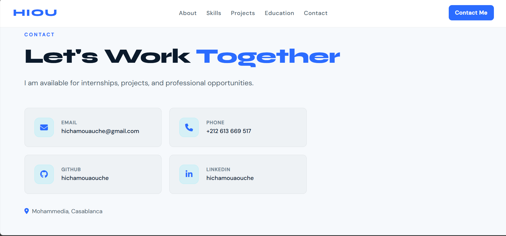

# Mini Projet 1 - Portfolio Web (HTML + CSS)

## 1. Presentation du projet

Ce mini-projet consiste a realiser un portfolio web personnel statique en `HTML5` et `CSS3`.
Le site met en avant le profil de **Hicham Ouaouche**, etudiant en **Cybersecurity** et **Artificial Intelligence**.

Objectif principal:
- presenter clairement le profil academique et professionnel
- valoriser les competences techniques
- afficher des projets realises
- faciliter la prise de contact

## 2. Objectifs pedagogiques

Dans le cadre du module Technologie Web, ce projet permet de pratiquer:
- la structuration semantique d'une page HTML
- la mise en forme avancee en CSS
- l'utilisation de `Flexbox` et `Grid`
- la creation d'une navigation interne avec ancres (`#about`, `#skills`, etc.)
- l'organisation d'un mini-projet front-end simple et lisible

## 3. Technologies utilisees

- `HTML5`
- `CSS3`
- `Google Fonts` (Syne, DM Sans)
- `Font Awesome` (icones)

## 4. Structure du projet

```text
.
|- index.html
|- style.css
|- hicham.jpeg
|- README.md
`- screenshots/
	|- Hiou.png
	|- About.png
	|- Skills.png
	|- Project.png
	|- Education.png
	|- Contact.png
	`- Contacte_me.png
```

## 5. Description fonctionnelle du site

Le portfolio est construit en page unique (single page) avec les sections suivantes:

1. `Hero`
	presentation rapide du nom, du domaine et d'un visuel principal.

2. `About`
	resume du parcours, des objectifs et du positionnement professionnel.

3. `Skills`
	competences techniques organisees par categories:
	securite, programmation, systemes/reseaux, IA & big data.

4. `Projects`
	liste de projets recents avec technologies associees.

5. `Education`
	parcours academique affiche en timeline.

6. `Languages`
	langues maitrisees (Arabic, French, English).

7. `Contact`
	informations de contact directes (email, telephone, GitHub, LinkedIn).

8. `Contact form panel`
	mini formulaire avec ouverture du client mail via `mailto:`.

## 6. Choix de conception UI/UX

- Theme clair moderne avec palette bleue
- Navigation fixe en haut pour acces rapide aux sections
- Mise en page responsive (desktop/mobile)
- Utilisation d'icones pour ameliorer la lisibilite
- Hierarchie visuelle claire (titres, badges, cartes, timeline)

## 7. Captures d'ecran

### Accueil (Hero)


### A propos


### Competences


### Projets


### Education


### Contact


### Formulaire Contact Me


## 8. Execution du projet

1. Ouvrir le dossier du projet dans VS Code.
2. Ouvrir `index.html` dans un navigateur.

Aucune dependance externe n'est a installer.

## 9. Informations de contact affichees

- Email: `hichamouauche@gmail.com`
- Telephone: `+212 613 669 517`
- GitHub: `https://github.com/hichamouaouche`
- LinkedIn: `https://linkedin.com/in/hichamouaouche-64847832b`
- Localisation: `Mohammedia, Casablanca`

## 10. Limites actuelles et ameliorations possibles

Limites:
- site statique (pas de backend)
- formulaire base sur `mailto:` (depend du client mail local)

Ameliorations possibles:
- connecter le formulaire a un backend (`PHP`/`Node.js`)
- ajouter une section Certifications
- ajouter des liens live/demo pour les projets
- optimiser davantage l'accessibilite (labels ARIA supplementaires, contrastes)

## 11. Conclusion

Ce mini-projet repond a l'objectif de creation d'un portfolio web personnel, avec une interface moderne, une structure claire, et une bonne base technique en HTML/CSS pour evoluer vers une version dynamique a l'avenir.
